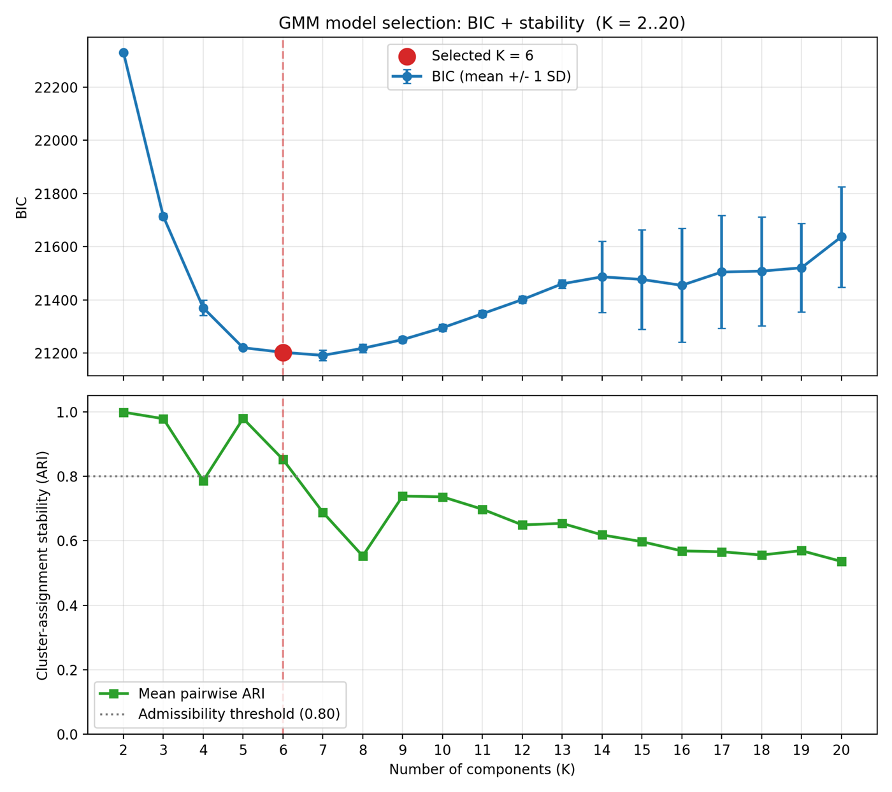
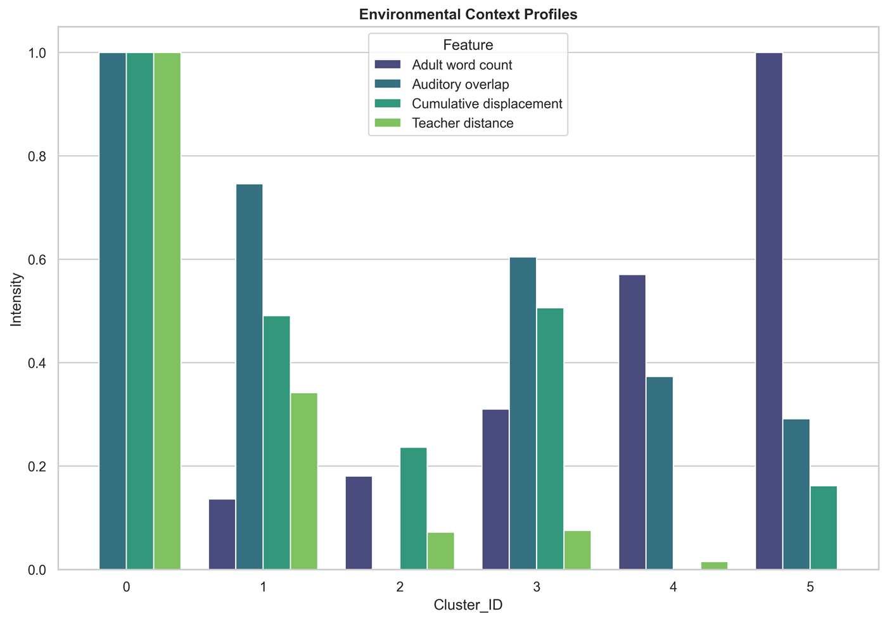
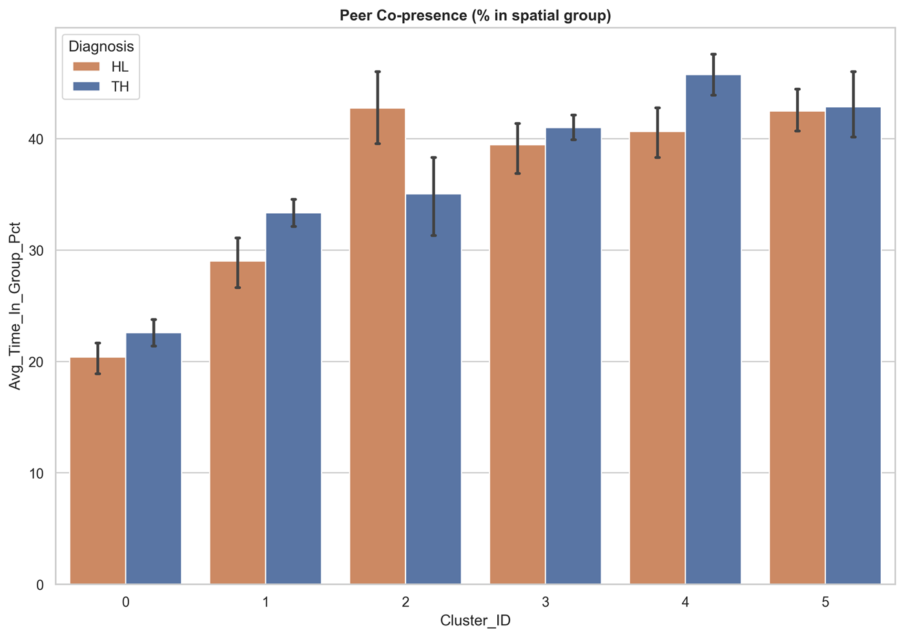
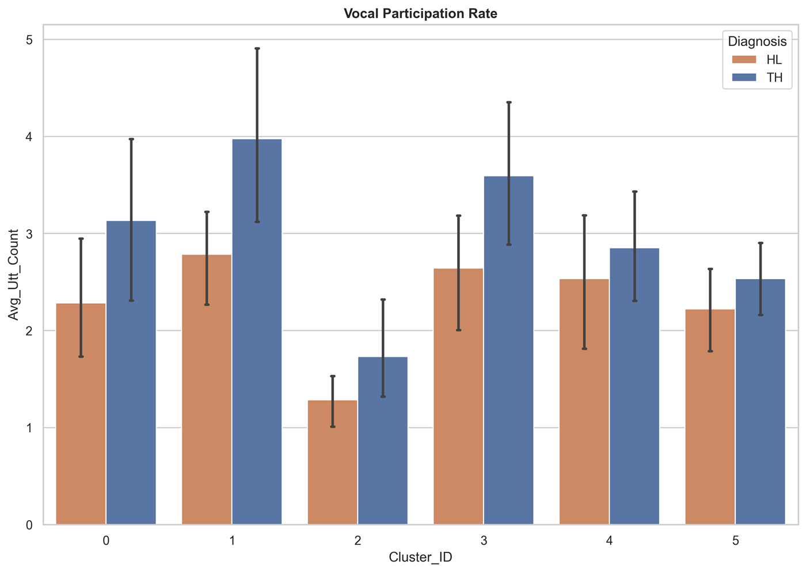
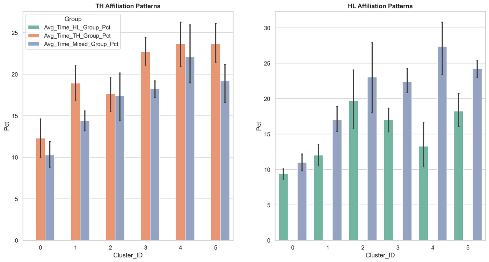

# Activity-Context Clustering for Social-Inclusion Analysis

MSc thesis pipeline, TU Delft (2026). It discovers latent activity contexts in an inclusive preschool from fused ultra-wideband (UWB) spatial tracking and LENA audio, then compares children with hearing loss (HL) and their typically hearing (TH) peers on three sensor-derived behavioural markers of inclusion within each context.

Companion thesis: *Automated Discovery of Latent Activity Contexts from Multimodal Sensing for Peer-Interaction Analysis in Preschoolers with Hearing Loss*, Shreya Sebastian, 2026.

## Summary

A Gaussian Mixture Model on four room-level features (adult word count, auditory overlap, cumulative displacement and teacher distance), with the number of components chosen by a stability-aware BIC rule over K = 2 to 20, recovers **six** activity contexts in a single inclusive preschool classroom (13 children: 6 HL, 7 TH). Within each context, a linear mixed model with a per-child random intercept compares HL and TH children on **peer co-presence**, **vocal participation rate** and **peer affiliation patterns**. The HL/TH differences are context-specific: each marker differs significantly in some contexts and not in others, and much of the signal disappears when the day is analysed as a whole.

## Why this problem

In inclusive classrooms, the physical presence of HL children does not guarantee social inclusion with TH peers. Self-report is biased, and manual observation is too labour-intensive to cover a full school day at fine temporal resolution. Wearable sensing records co-presence and vocal activity continuously, but the meaning of those signals depends on what the room is doing: a minute of quiet table work and a minute of free play are not comparable. The pipeline therefore labels every (child, minute) with an activity context and tests inclusion within each context.

## Research questions

> **RQ1.** Can a set of interpretable latent activity contexts in an inclusive classroom be recovered from fused UWB spatial data and LENA acoustic data using unsupervised clustering?
>
> **RQ2.** Within each recovered activity context, do HL children and their TH peers differ on three sensor-derivable behavioural markers of inclusion: (a) peer co-presence, (b) vocal participation rate and (c) peer affiliation patterns?

## Data

- **UWB positioning.** Each child and teacher wears a vest with two Ubisense tags, giving position and shoulder orientation at 10 Hz.
- **LENA audio.** Each child wears a LENA recorder; its offline speaker-type segments give child utterances, adult word counts and overlap.
- **Coverage.** 13 recording days in one classroom, about 164 minutes per child per day. The fused stream gives 22,730 (child, minute) rows; 22,251 minutes with at least three children jointly observed are labelled with a context, and the 21,847 that fall on attendance-confirmed days are used for the statistics.

The data are **not redistributable**: they are child-worn audio and indoor tracking of minors, collected under a research-ethics protocol that does not permit public release. This repository contains the analysis pipeline only.

## Pipeline

```
UWB (10 Hz x, y, θ)                      LENA (time-stamped speaker-type segments)
        │                                              │
        ▼                                              ▼
per-frame displacement, teacher distance,     proportional binning of adult words,
spatial groups via Dominant Sets on a         overlap and utterances into
proximity × mutual-orientation affinity       one-minute epochs
(σ = 0.5 m)                                            │
        │                                              │
        ▼                                              │
per-child, per-minute spatial features                 │
        └────────────► join on (child, minute) ◄───────┘
                                │
                                ▼
          room-level mean over children present (≥ 3 per minute):
          adult word count, auditory overlap, displacement, teacher distance
                                │
                                ▼
                 Yeo-Johnson transform per feature
                                │
                                ▼
        full-covariance GMM, K chosen by stability-aware BIC (K = 2..20)
                                │
                                ▼
                  context label per (child, minute)
                                │
                                ▼
   LMM: outcome ~ cluster × diagnosis + (1 | child), per-cluster Wald contrasts
   + Mann-Whitney U on per-child homophily, Benjamini-Hochberg FDR per marker
```

**Spatial groups.** Groups of children who are simultaneously close and mutually body-oriented are detected with the Dominant Sets framework. They are motivated by the F-formation idea but are not claimed to be F-formations, since it is not established that children of this age form them. Orientation is shoulder orientation from the two tags, not gaze.

**Choosing K.** For each K from 2 to 20, twenty full-covariance GMMs are fit (each with ten restarts and its own seed). K is admissible if the mean pairwise Adjusted Rand Index between the twenty label sets is at least 0.80; the admissible K with the lowest mean BIC is selected. The admissible set is {2, 3, 5, 6} and K = 6 is chosen. K = 7 has a slightly lower mean BIC but does not reproduce across seeds (mean ARI 0.69). Cluster IDs are re-indexed by ascending adult word count.



## Recovered activity contexts



| Cluster | Descriptive label | Share of time | Sensor signature |
|---|---|---|---|
| 0 | Dispersed transition | ~6.9% | Lowest adult speech, highest displacement and teacher distance (~9.4 m) |
| 1 | Peer-driven activity | ~6.0% | Low adult speech, high overlap, teacher comparatively far (~4.2 m) |
| 2 | Independent / parallel work | ~8.6% | Lowest auditory overlap, low adult speech, fewest utterances |
| 3 | Adult-scaffolded peer activity | ~33.9% | Moderate adult speech, high overlap, teacher close (~2.1 m) |
| 4 | Seated guided work | ~9.8% | High adult speech, lowest displacement, teacher close (~1.6 m) |
| 5 | Whole-class instruction / read-aloud | ~34.8% | Highest adult speech (~66 words/min), teacher closest (~1.5 m) |

The labels are post-hoc descriptions of the sensor profiles. They are qualitatively consistent with an independent manual coding of the daily routine (eight activity types), which was consulted only after K was fixed and never used to fit the model. The statistics are computed on cluster IDs, so the labels do not affect any test.

## Findings

| Marker | Pattern across the six contexts |
|---|---|
| Peer co-presence | Differs in three of six contexts, with opposite signs: HL above TH in independent / parallel work (+7.8% of the minute, d = +1.59, q < 0.0001); HL below TH in peer-driven activity (−4.3%, q = 0.02) and seated guided work (−5.3%, q = 0.002). |
| Vocal participation | HL children produce fewer utterances where peer talk is fast and adult scaffolding is reduced: peer-driven activity (q = 0.034) and adult-scaffolded peer activity (q = 0.048); dispersed transition in the same direction but marginal (q = 0.071). No significant gap in the three adult-dominated or quiet contexts. |
| Peer affiliation | The most consistent asymmetry: TH grouped time is concentrated in TH-only groups, while HL children spend more grouped time in mixed groups than TH children in all six contexts (significantly in four). The homophily index is lower for HL children in all six (significantly in four). |







Pooled over the whole day, the HL/TH difference in peer co-presence is close to zero (HL 38.8%, TH 39.9%), because context-specific effects of opposite sign cancel. The cohort composition (6 HL, 7 TH) alone gives TH children a homophily advantage of about 0.08 under random affiliation; in the four significant contexts the observed gap is 0.12 to 0.19.

## Limitations

- A single classroom with 13 children; the six contexts and the HL/TH directions need multi-site replication.
- The context labels are descriptive and not validated against coded ground truth.
- Orientation is shoulder rather than gaze, so peer co-presence carries some unquantified measurement error.
- Each child contributes about a tenth of the room average that defines its own context label, a weak circularity.
- The markers are proxies for inclusion; they show exclusion risk, not whether bids for interaction are taken up.

## Running the pipeline

```bash
pip install -r requirements.txt
python src/run_pipeline.py
```

`run_pipeline.py` runs the stages in order (acoustic features, spatial features at 100 ms, one-minute aggregation, clustering, per-child aggregation, dashboard, statistics) and skips stages whose outputs already exist. The clustering stage writes the selected K to `selected_k.txt`, which the later stages read. Raw data are expected under `data/` and are not included.

## Software and reproducibility

- Python 3.10+ with pandas, NumPy, SciPy, scikit-learn and statsmodels; plots with matplotlib and seaborn. Versions are pinned in `requirements.txt`.
- The GMM sweep uses seeds derived deterministically from a fixed base seed, so K selection and clustering reproduce exactly on the same input.
- The Dominant Sets iteration starts from the uniform point of the simplex and runs to a fixed tolerance (1e-6) under a fixed iteration cap, so the spatial features are deterministic as well.
- The statistical analysis is restricted to (child, day) pairs marked present in the attendance record.

## Acknowledgements

Thesis supervised at **TU Delft** by **Hayley Hung** and **Stephanie Tan** (Socially Perceptive Computing Lab), with external supervision from **Daniel Messinger** and **Lynn Perry** (University of Miami).

The pipeline builds on two earlier contributions from the same group:

- [TUDelft-SPC-Lab/group-detection](https://github.com/TUDelft-SPC-Lab/group-detection): the Dominant Sets spatial group extractor, by **Stephanie Tan**.
- [TUDelft-SPC-Lab/ICDL2025](https://github.com/TUDelft-SPC-Lab/ICDL2025): the socio-spatial affinity parameterisation, by **Yuan Tian**.
